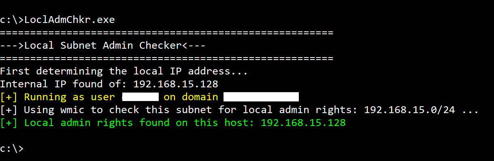

# /24 Subnet Local Admin Checker

Simple tool written in C# as an independent side project. Uses threading to quickly check what other hosts (inside of the target machine's /24 subnet) that the current user context has local admin rights on.

Takes less than 1 minute to check the /24 subnet due to the threading.

**_How It Works:_**
- checks hosts on the same /24 subnet with this command wmic command: "wmic /node:<host> computersystem list brief /format:list"
- Searches for successful execution of the command above based on the response

**_Usage:_**
1. This was written as a Visual Studio Console App (.NET Framework); open the project in Visual Studio and build to get your .exe
2. Launch cmd.exe as whatever user identity you want to check and run the .exe; can also be incorporated in pen test tools and executed remotely.

**note:** This tool is detectable if local use of wmic is monitored as well as /24 inter-host communications.

